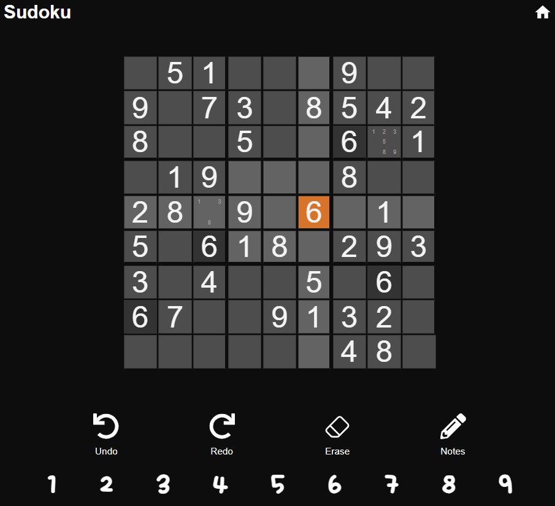
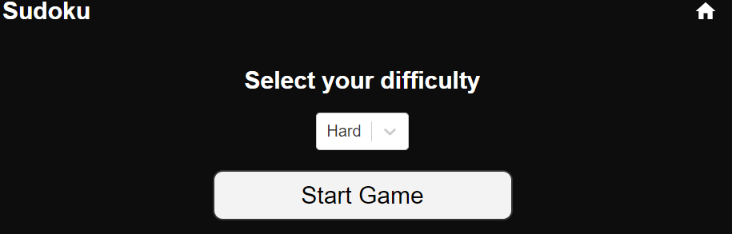
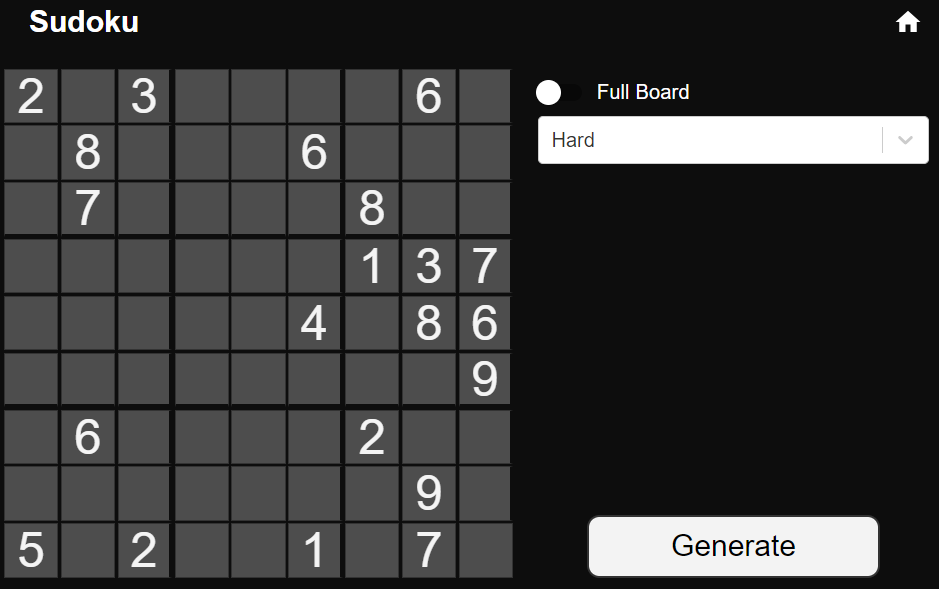
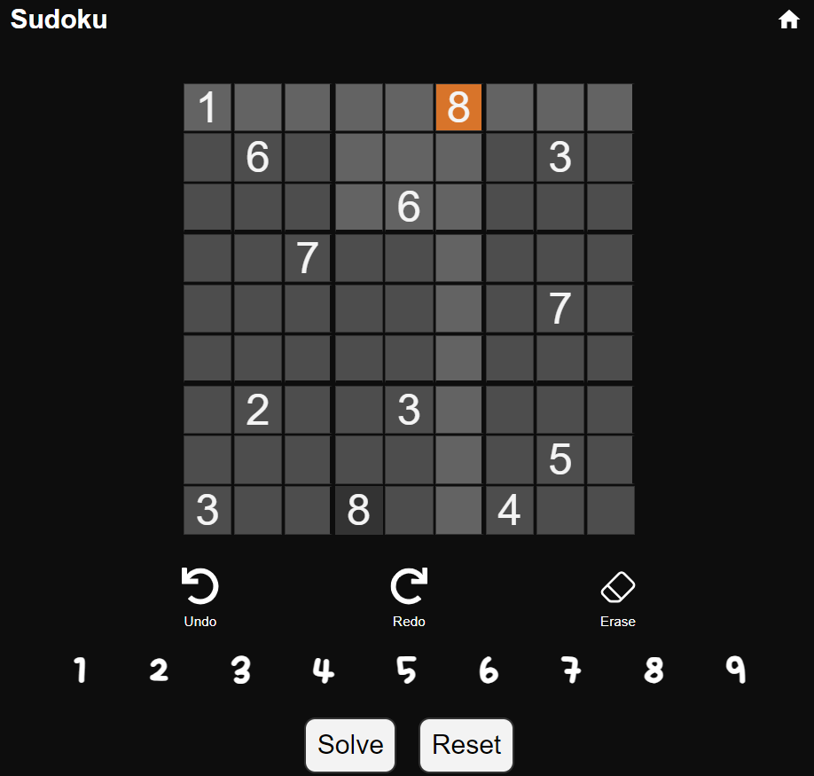

# Sudoku Game 🧩

Welcome to the React Sudoku Game! Dive into the world of Sudoku and challenge yourself with four different difficulty levels. If you're ever stuck, the built-in solver is here to help! Want to create your own puzzle? We've got you covered with our puzzle generator.



## Features 🌟

- **Selectable Difficulties:** Choose between four levels of difficulty to test your skills.
- **Puzzle Generator:** Generate puzzles across various difficulties, or even a fully solved puzzle to admire the beauty of Sudoku.
- **Puzzle Solver:** Stuck on a move or just curious? The built-in solver can solve any puzzle you throw at it.

## Getting Started 🚀

### Installation

1. Clone the repo:
   ```sh
   git clone https://github.com/thimer-logan/sudoku.git
   ```
2. Navigate to the frontend directory:
   ```sh
   cd sudoku/sudoku_frontend
   ```
3. Install the dependencies:
   ```sh
   npm install
   ```
4. Start the development server:
   ```sh
   npm start
   ```
5. In a new terminal, navigate to the backend directory:
   ```sh
   cd sudoku/sudoku_backend
   ```
6. Build the cmake project.
7. Navigate to the build directory:
   ```sh
   cd out/build/x64-debug/src
   ```
8. Run the server executable:
   ```sh
   ./SudokuAPI.exe
   ```

Your Sudoku game should now be running locally!

## Usage 🎮

1. **Selecting a Difficulty:** From the main menu, click "Play Game" and choose your desired difficulty level to begin.

   

2. **Generating a Puzzle:** Click on the "Board Generator" button and select your preferred difficulty or choose a fully solved puzzle.

   

3. **Solving a Puzzle:** If you're stuck or curious about the solution, enter a puzzle into the solver to see the magic.

   
